# 🚀 UmkaBuild — CLI-білдер з душею

UmkaBuild — це інтуїтивний CLI-інструмент для збірки `.exe` файлів з Python-проєктів за допомогою `pyinstaller`.  
Створено з любов’ю до терміналу, з турботою про розробника.

---


## 🧠 Можливості

- ✅ Збірка `.exe` з будь-якого `.py` файлу
- 🖼️ Автоматичне додавання іконки (Якщо є)
- 📁 Підключення папок і вкладених ресурсів
- 🧾 Збереження та повторне використання команд
- 📂 Перевірка на порожню теку `source_files`
- 🧹 Очищення старих білдів перед запуском
- 🎛️ Меню з опціями PyInstaller
- 🌐 Підтримка української та англійської мови
- 💡 ASCII-логотип, версія, філософія

---


## 📦 Структура проєкту
```bash
UmkaBuild/ 
├── source_files/			# Сюди копіюється ваш .py проєкт 
├── dist/					# Сюди потрапляє .exe 
├── core/					# Логіка, переклади, збереження 
├── build_config_save.json	# Збережена команда 
├── UmkaBuild.py			# Сам білдер
```

---

## 🚀 Запуск
```bash
python UmkaBuild.py
```

---

## 🖥️ Як запустити `.exe`

1. Відкрийте термінал (Win + R → `cmd`)
2. Перейдіть до теки з `UmkaBuild.exe`:  
   `cd шлях_до_текі`
3. Запустіть:  
   `./UmkaBuild.exe`

⚠️ Подвійний клік може не працювати — це нормально. UmkaBuild працює в терміналі.

---

## 📸 Скриншоти
```markdown
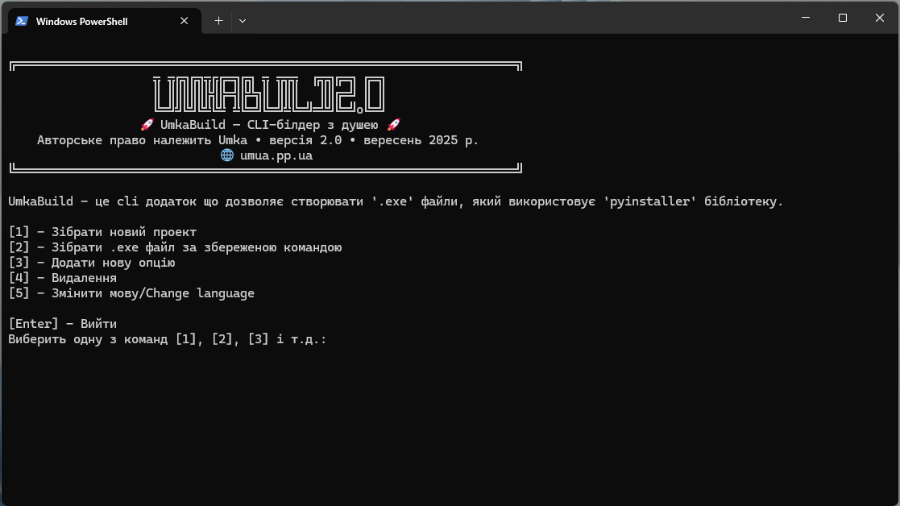
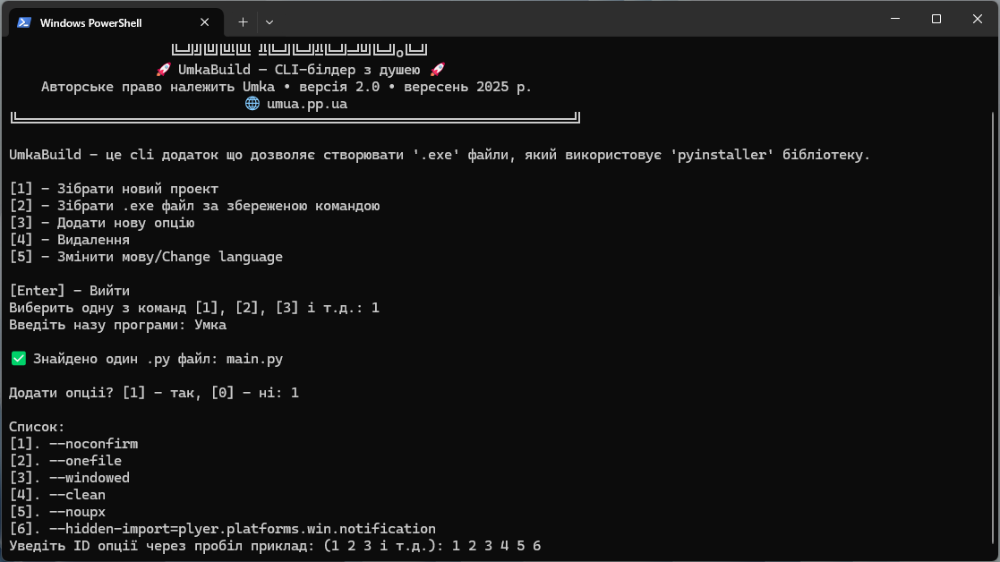
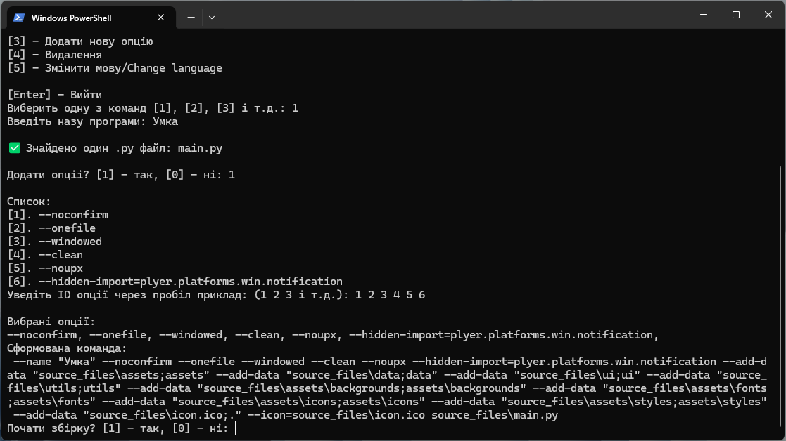
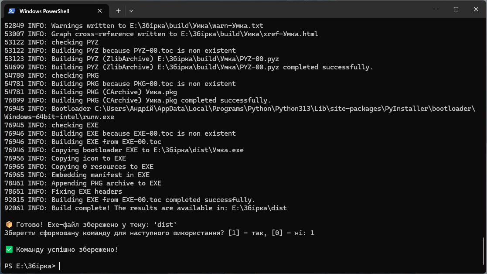
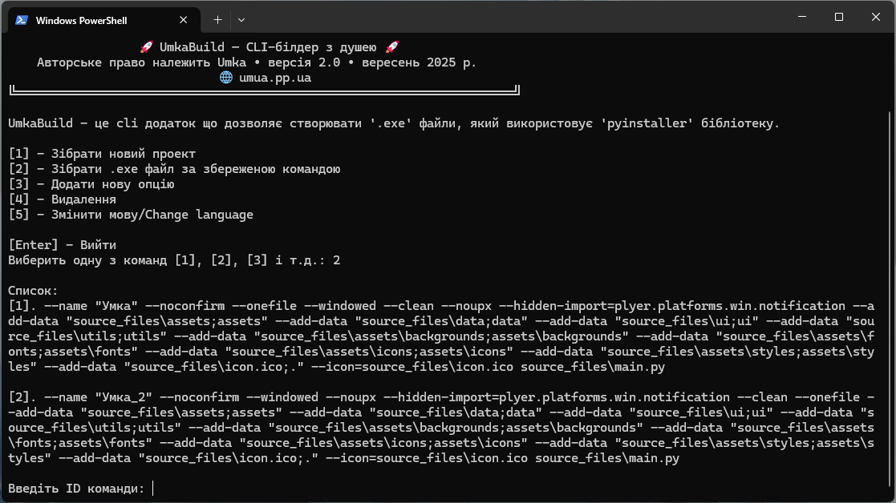
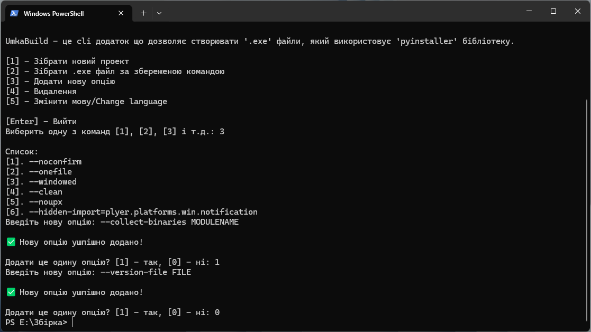
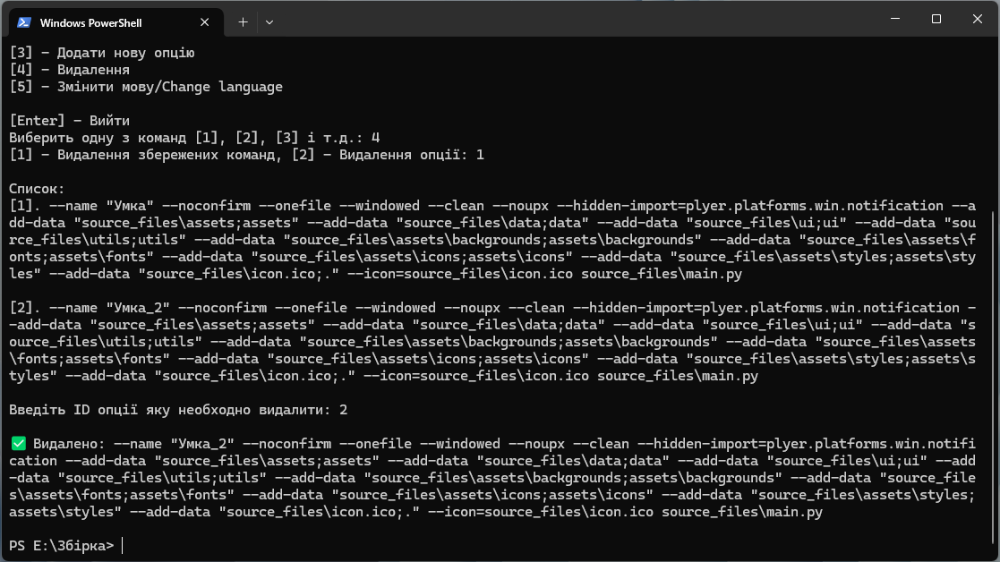
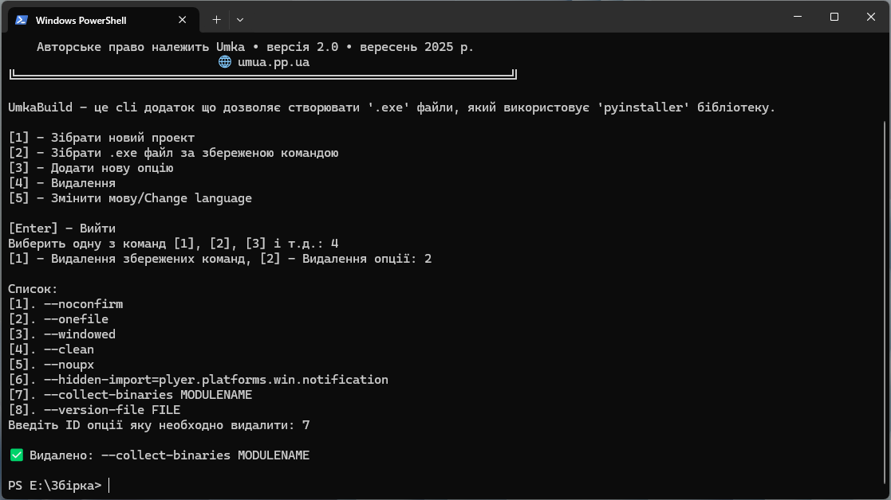


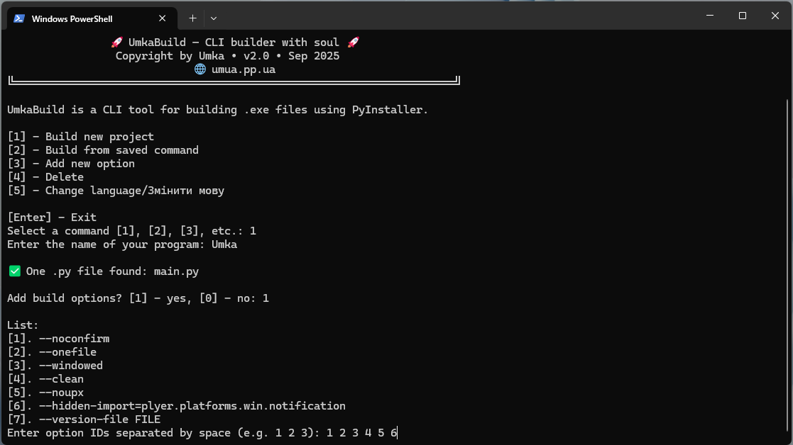
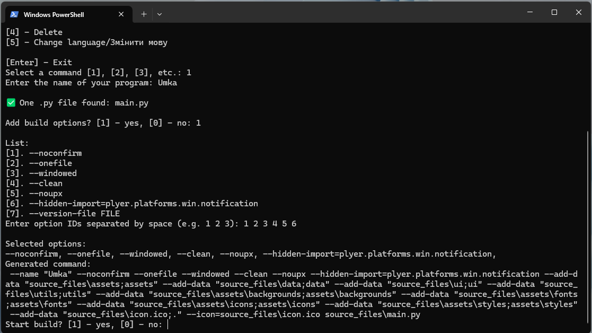
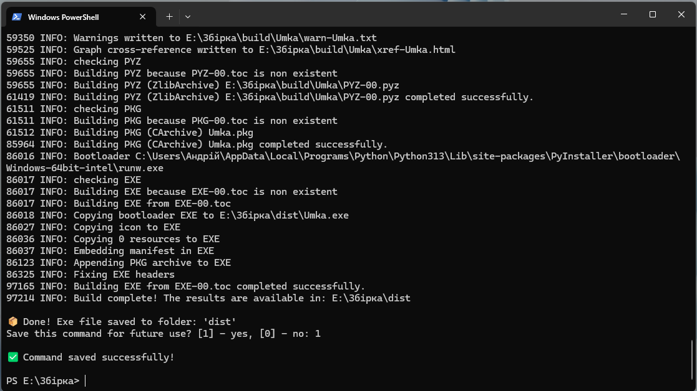
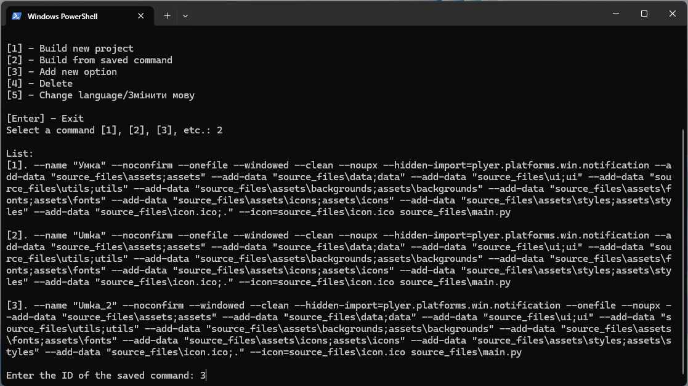
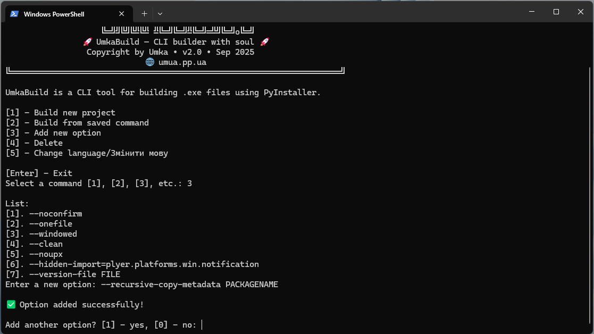
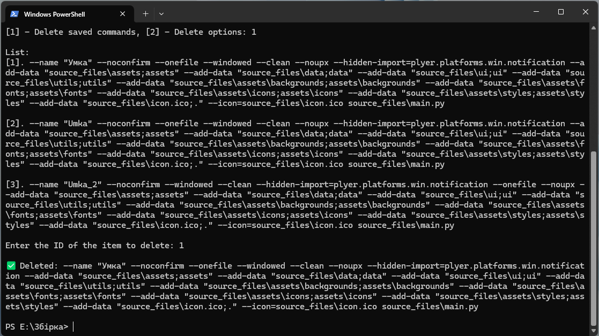
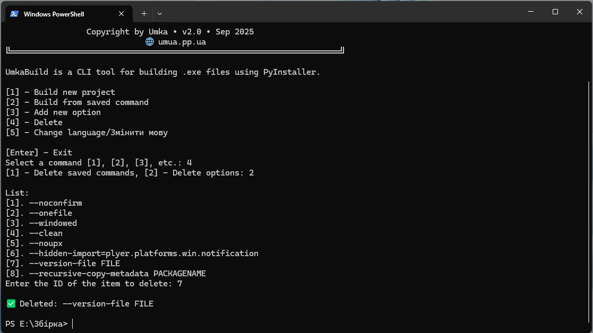
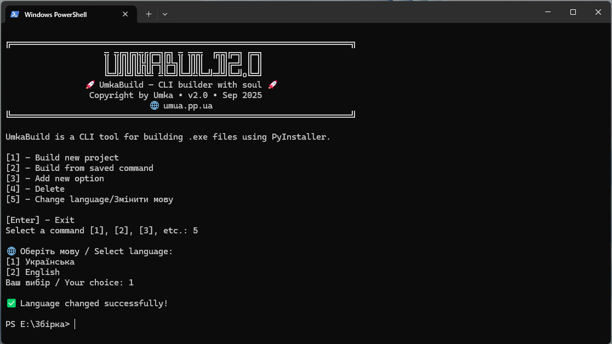
```

📜 Ліцензія
MIT License

🌐 Сайт: umua.pp.ua


🧑‍💻 Автор
Андрій — розробник, який перетворює термінал на місце сили.
UmkaBuild — це не просто білдер, це інструмент з характером.
